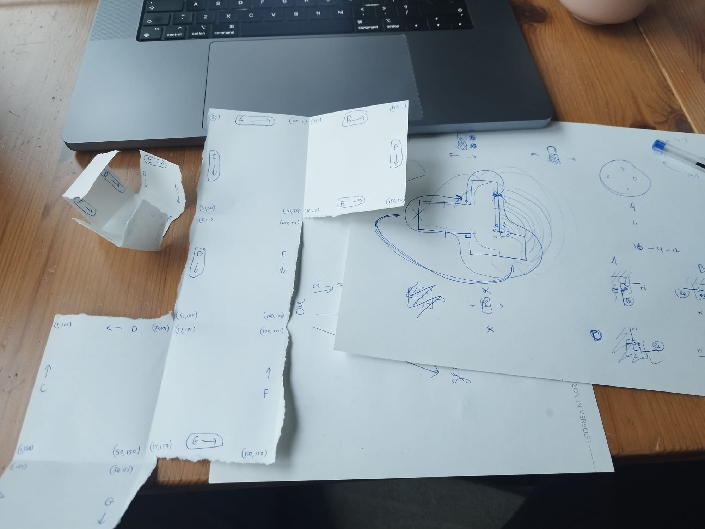

# Advent of Code 2022, using Rust

See https://adventofcode.com/2022

## Links

- Leaderboard competitor with Python solutions that I've looked at when I got stuck: https://github.com/ivankra/advent-of-code
- Amazing, this person wrote poems for each day :D Really puts my little diary attempt to shame 😅: https://github.com/HiggstonRainbird/AoC-2022
- Friends also participating:
  - [Stijn](https://github.com/AuguB/Rust_Advent_Of_Code_2022)
  - [Auke](https://github.com/Fadarrizz/advent-of-code)

## Diary

- **Day 1.** Ah, it's not that hard! :)

- **Day 2.** First went all `enum Shape` and `impl FromStr` and `shape.score()` etc., but then later figured that for a script, simple `const`s make for way simpler and readable code :)

  - Learned: don't always need `enum/impl`

- **Day 3.** Note the funny `'a'..'{'` — I later learned the syntax `'a'..='z'` from Auke's solution :P

  - Learned:
    - `..=`
    - `code - ('a' as i32)`

- **Day 4.** I decided to go with an actual separate parser, figuring parsing the input of subsequent days would probably get harder and harder. A bit unnecessary here ofc. Also, how did I not know about `fs::read_to_string` in previous days? :P

  - Learned:
    - `fs::read_to_string`

- **Day 5.** The first significantly harder day! Not because of the parsing though (regexes work just fine), but because of data & ownership stuff I guess.

- **Day 6.** Surprisingly simple, too bad! :P

- **Day 7.** Harder again.

  - First I had an `enum Item { Folder, File }`, but then I had to write so many `match` blocks, even if using common data (like `name`), that I went for a more pragmatic `struct Node` with some redundancy. And then it was just a bit finnicky to get it all right.
  - Went immediately for a flat data structure w/ userland indirection instead of a recursive data structure, because I know that ownership gets really complicated otherwise — probably saved me quite some time.
  - For simplicity, I made `compute_folder_size` accumulate the folder sizes through a `&mut Vec<usize>` instead of trying to merge resulting vectors. => Q: is this the Rust way?

  - Learned:
    - `split_once`

- **Day 8.**

  - Wasn't too hard, but I did get into some finnicky trouble with `take_while` trying to get the bonus to work. The way the puzzle is written, it's more like `take_until(_and_including)`, which wasn't exactly what the crate `take-until` gives. And then I made a small attempt at creating my own `TakeUntil` trait + impl, before settling for quicker approach of just writing a very specific `fn count_until`.
  - Also the performance won't be optimal, but the immediate fix is to decide in which order to check the lines of vision for visibility (instead of always checking up, down, left, right).
  - Learned:
    - Didn't actually learn today, but was reminded again of how taking a `mut p` where `P: FnMut` is more general than just `p: fn`. Not actually necessary even, but, I just took it from the `TakeWhile` implementation, and now `count_until` could also choose to be a closure that mutates.

- **Day 9.** Fun, and especially a fun generalization in the bonus exercise this time :)

- **Day 10.** Not really sure how the ownership transfers work, between the mutating closure and it's surrounding scope in `solve`, but, it works :D

- **Day 11.** That was quite a bit harder! For three main reasons:

  1. The parsing. I wanted to do it a bit more "defensively", and so I turned to the builder pattern for constructing the `Monkey` instances. After starting writing it myself, I decided a crate must exist for it, and I started using `derive_builder`. Then I spend some time fiddling with the level of "defensiveness" in the line parsing loop, struggling with putting the builder in an `Option` but also keeping it mutable, which turned out to be a hassle. In the end I just kept is pragmatic and simple.
     - I like my cute little `MiniExpr` / `MiniNode` structs with their `parse` and `eval` implementations :P
  2. Fighting with the borrow checker over mutating other monkeys while looping over the monkeys in each round. There must be a more elegant way of doing this, but, I was already spending so much time on today's challenge, that I just went with whatever worked :P
  3. The bonus. I first tried the "silly thing" and just rewrote it to use `BigInt`s, but, that wouldn't have worked anyway, because the numbers get unmanageably large and the code would not stop running. The trick is that we're working modulo `n`, where I first (incorrectly) set `n` to each respective monkey's divisibility check number, but then later, after taking a break to help my roommate buy stuff for Christmas dinner, figured that it should be all these monkeys' numbers multiplied by each other, because the items move hands and therefore shouldn't lose information in between.

  To learn:

  - Learn better error handling, i.e. no more `type Err = ();`
  - Learn how to do the mutable iterator & vector updates thing (point 2) in idiomatic Rust

- **Day 12.** Ai! We seem to have gotten to the part of the advent calendar where every challenge is getting hard :P Where yesterday, for the bonus star, you needed a bit of mathematical knowledge, today, you need a programmer's trick: Instead of just performing the entire search algorithm once for every possible starting point, which amounts to a very lengthy computation, it's better to generalize the algorithm, which then interestingly takes less time also :P What a fun bonus star generalization again!

- **Day 13.** Today had three main parts, for me:

  - Getting acquainted with Nom
  - First failing at `PartialOrd for Packet`, and then reimplementing it after
  - ..getting the actual ordering computation right -- trickier than I thought

  Learned:

  - Nom
  - `<iter>.position(<predicate>)`
  - `PartialOrd`, `Ord`
  - Putting `use crate::{whatever}` imports inside the test function keeps the linter happy :)

- **Day 14.** The bad news is that it's taking me longer every day to solve. The good news is that I'm still having a lot of fun doing so :)

- **Day 15.** Wow, ok, this one really does need smart thinking.

  I first implemented it the naive way, but quickly found out that that won't do. Then I implemented a `Spans` type that keeps track of a list of spans, that it keeps sorted and as small as possible, so that I don't need for-loops to check the grid but can just work with equations. This way, computing the solution took less than a millisecond.

  But although it's a perfectly reasonable solution for the first part, but it doesn't generalize automatically to the second part. It did allow me to "brute-force" the second part though, which takes about 11 seconds.

  After that, I went to Reddit for the first time, to check what other people did, and it indeed turns out that you have to get quite creative to solve today's challenge in a performant way. Lots of mathematical and programmatic tricks that I would never have thought of! It seems I'm gonna have to up my game for the second half of the calendar! :P

  Haha, oh and later, I used `rayon` for the first time, to parallelize the brute-force search. So easy to add, and it takes the time down from ±11s to ±2.5s on my machine (8 cores).

  _Update: actually, with `--release`, the bonus part takes ±200ms with Rayon, and ±800ms without._

- **Days 16 and 17.**

  Both days 16 and 17 were very hard! Day 16 was the first I didn't solve on the day itself, and I haven't been able to solve the bonus parts of both days yet :P

  Day 16 seems to require an exhaustive search, at least naively. Which I've implemented, possible not optimally, and it took my machine about 30 minutes to solve. But definitely I won't be able to solve the bonus part this way. Later, I got the idea to simplify the tunnel network a bit, removing the zero-flow-rate valves (except for the starting point `AA`). This reduces the time from 30 min to 20 min, which isn't a meaningful improvement, but, I think I might be on to something with the simplification of the network. Maybe with some extra thinking, I can replace the search algorithm with an algorithm that simplifies/contracts the network step-wise, until it ends up with a single node, or something. This would mean linear (or maybe log) time, instead of combinatorial.

  _Update: actually, with `--release`, it takes around 2m._

  Day 17 seemed to just be a simple simulation, but then too, the bonus is intractable, so there must be some way to phrase it differently, that I haven't though of yet.

  _Update (on day 24): I've solved the bonus part now, too. I knew it had to be something with a repeating pattern, but I couldn't figure out how to do that. (Using LCM of 5 and 10091 doesn't just work, because the rock placement pattern might be different, etc.) But then, reading Reddit, someone described how to do it: take the relative heights of the top blocks + the next rock and jet index as a hash. Smart! Using that technique, both parts now run in a constant time of just around 5ms, which is basically just the overhead of getting to the repeating part, and the last bit of work afterwards. Nice! :)_

- **Day 18.**

  Pfew, here again is at least something I can solve without too much effort :P Although the bonus part did challenge my algorithmic thinking, and it took a few takes (due to conceptual mistakes) to get it right.

  Fun!

  Is it optimal tho? Probably not.. But, with `--release` it only takes ±25ms, so that's fiine :)

- **Day 19.**

  _TODO_

- **Day 20.**

  Wow, I spent waaaay too much time thinking in loops about indices, getting nowhere.. Finally, I went online to look at other people's solutions, and it turned I totally overengineered it also. I had a really complicated function `move_index_by` that would deal with the weird (but not as weird as I though) modulo arithmetic of the target index of a moving tile. I got totally caught up in the test case that the `-2` at position `2` would loop around to the last position, instead of going to position `0`. But, I overlooked the fact that it's really only just a case of formatting, because it's a loop. I should have seen this earlier, and then just colocate the numbers and their original indices in the same vector, and also just not worry about the performance hit of always looping through the vector to find the next number.

  The bonus part calculation took .. more than 5 hours XD (I left it on overnight.) What's also funny/new to me to see, is that it's all due to the size of the numbers involved in the multiplication. There's a very simple 10-factor scale between the number of digits (past 4) in the decryption key and the total calculation time. I guess this is super obvious, but, first time I've seen it so strikingly.

  _Update: actually, with `--release`, the bonus part takes around 1h 45m._

- **Day 21.** Fun and not too complicated :)

- **Day 22.**

  Part 1: fine. Part 2: seemed like a cute generalization at first, but I totally overlooked how hard it was :P After a misguided attempt at an algorithm that would "glue" the cube together along the single seam, obtained by traversing the boundary of the 2d pattern (silly me for thinking it's that simple 😅), I gave up and just hard-coded the cube edges, after which I turned to Reddit and saw that I was not the only one. But I couldn't stop myself, later, from spending suuper long trying to get a folding algorithm to work, and, in the end, I did it :) With a naive DFS, whack rotation code, and keeping track of the faces' original coordinates along the way :) The code is hella ugly, due to the incremental solving process, haha, but I'm leaving it as is now :P At least it's fast, about 2ms.

  Also, here's my "MANDATORY" cube :D

  

- **Day 23.**

  Not every day is hard! This one, I almost implemented in a single pass without debugging :)

  _ALSO, I found out that I totally forgot to use the `--release` flag when running on the actual input, on the more compute-intensive days. Turns out, for example.. that day 16 might take ±20min when running in debug mode, but only **138s** when running without all the debug tooling set up! (This is still not enough to simulate all 1000000000000 blocks in day 17 of course, but still :P)_

- **Day 24.**

  This is a fun twist of the same kind kind of breadth-first "flooding" search algorithm as on day 12 (finding the length of the shortest route across a grid with certain moving constraints). Fun!

  To see how it would work out, I decided to write most of the code in a single function scope, with a bunch of small helper closures etc., and keeping all the relevant pieces of data in local variables instead of assigning them to a rather arbitrarily named struct. I kind of like the flexibility of this approach, because immediately moving to conceptually named structs can hinder the "problem-solving" / "scripting" mode I'm working in when solving an algorithmic challenge. (Of course, the rigidity and semantic clarity of using aptly structs etc. is better when building larger software, but, that's now what I'm doing with the Advent of Code :))
